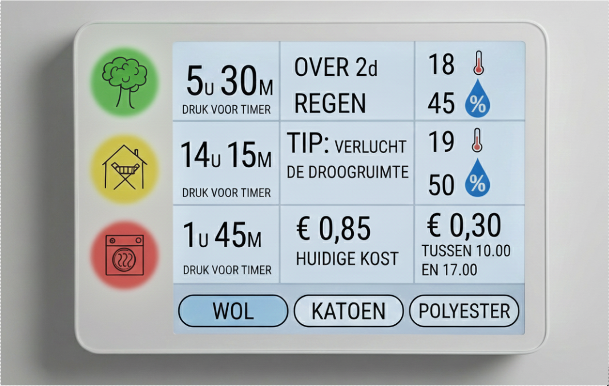

# De Drooghulp
De drooghulp is een slim apparaatje dat helpt de beste manier te kiezen om de was te drogen.

🛠️ Built by ``Djurre Roose`` & ``Jutte De Baets``   
🔥 Supervised by ``prof. dr. Bas Baccarne``, ``Yannick Christiaens`` & ``Wouter Devriese``    
🌱 Grown at ``Ghent University`` 🏛️ ``Industrial Design Engineering`` ([project overview](https://github.com/basbaccarne/human-centered-design))       

*Dag/Maand/Jaar van de laatste update*   

## Samenvatting
"Met het wisselvallige Belgische weer is het lastig te voorspellen of je de was buiten kunt hangen. Ook binnen drogen is niet altijd ideaal. De droogkast is dan vaak de makkelijkste, maar helaas ook de minst ecologische keuze. 

 

Uit onze interviews over drooggewoontes blijkt dat de angst voor vocht en geuroverlast de belangrijkste reden is om niet binnen te drogen. Ook brachten we in kaart wanneer mensen hun wasmachine precies aanzetten. 

 

Onze 'drooghulp' adviseert wat de beste droogoptie is, met als doel de droogkast zo min mogelijk te gebruiken. Dit is beter voor de planeet én voor je portemonnee. Het systeem analyseert weersvoorspellingen (voor buitendrogen) en voert zelf metingen uit om te zien of binnen drogen mogelijk is. Is de droogkast toch de enige optie? Dan checkt de hulp of het slim is om even te wachten tot het daltarief ingaat." 

  

## Introductie

"Voor het opleidingsonderdeel Project Gebruiksgericht Ontwerp kregen we de keuze uit drie challenges om de theorie in de praktijk te brengen. Wij kozen resoluut voor het thema duurzaamheid. De opdracht was helder: ontwerp een fysiek product dat een probleem oplost en leidt tot een duurzamere uitkomst. 

 

Wij richten ons op het drogen van de was. In de praktijk gebeurt dit op drie manieren: buiten aan de lijn, binnen op een rekje of in de droogkast. Hoewel de droogkast door het hoge energieverbruik ecologisch de minst gewenste optie is, kiezen velen hier toch voor vanwege het gemak. 

 

De drooghulp die wij ontwikkelen, moet de duurzame opties weer vanzelfsprekend maken. Ons hoofddoel is het energieverbruik te verminderen door gedragsverandering te stimuleren. Een belangrijke randvoorwaarde hierbij is dat het apparaat zich beperkt tot slim advies en meldingen; het fysieke ophangen van de was blijft de taak van de gebruiker." 

## Inhoudstafel

1. [Methodologie](./docs/methodologie.md)
2. [Discovery](./docs/discovery.md)
3. [Defintion](./docs/definition.md)
4. [Design Requirements](./docs/design_requirements.md)
5. [Bill of materials](./docs/bom.md)

## Kritische reflectie
Kritische reflectie: 

Geen enkel project is perfect of ooit echt 'af'. Wij hebben ons best gedaan om met zoveel mogelijk factoren rekening te houden, maar beseffen dat het onmogelijk is om alles af te dekken. Hieronder volgt een opsomming van potentiële obstakels voor de werking van de drooghulp. Waar mogelijk zullen we in de verdere uitwerking naar oplossingen zoeken. 

Locatie van het drogen Het apparaat wordt logischerwijs in de wasplaats (het waskot) gehangen. Niet iedereen hangt de was echter op diezelfde locatie op. Omdat het apparaat zijn advies baseert op de lokale temperatuur en luchtvochtigheid, kunnen de sensoren een vertekend beeld geven als de was in een andere ruimte wordt gedroogd. 

Afhankelijkheid van wifi Het apparaat gebruikt online weersvoorspellingen om accuraat en up-to-date advies te geven. Zodra de wifi-verbinding wegvalt, verliest het apparaat een groot deel van zijn functionaliteit. Dit beperkt de inzetbaarheid op locaties met slecht bereik, zoals afgelegen plekken of kelders. 

De gemaksbarrière Dit product verlaagt de drempel om voor een duurzame optie te kiezen, maar neemt de fysieke handeling (de was ophangen) niet weg. Sommige gebruikers kiezen niet voor de droogkast vanwege de droogsnelheid, maar puur uit gemakzucht. Voor deze groep kan onze vorm van 'nudging' eerder als irritant dan als behulpzaam worden ervaren. 

Representativiteit van de steekproef Hoe groter de groep testpersonen, hoe beter het beeld van de potentiële gebruiker en diens behoeften. Hoewel wij tests hebben uitgevoerd, is de steekproef waarschijnlijk te klein en te weinig divers om een volledig realistisch beeld van de doelgroep te vormen. 

Toegankelijkheid (Kleurenblindheid) De kerninformatie wordt gecommuniceerd via gekleurde lampjes (groen, oranje, rood). Voor mensen met kleurenblindheid is dit onderscheid moeilijk of niet te maken. In het vervolgonderzoek moet worden nagegaan hoe we het product ook voor deze groep toegankelijk kunnen maken (bijvoorbeeld door andere signalen toe te voegen). 

 

## Noot inzake het gebruik van AI
De uiteindelijke tekst is met behulp van AI gecontroleerd op taalfouten en verfijnd voor een betere leesbaarheid.

## Bijlagen
### Discovery
* Benchmarks (N=10)
  * [Protocol](./reports%20and%20protocols/Protocol%20Benchmark%20Duurzame%20Was_Droogtechnologieen.docx.pdf)
  * [Rapport](./reports%20and%20protocols/Benchmark%20analyse.docx.pdf)
* Interviews (N=3)
  * [Protocol](./reports%20and%20protocols/Interview%20-%20protocol%20-%20Sustainability%20at%20home.docx.pdf)
  * [Rapport](./reports%20and%20protocols/Interview%20analyse.docx.pdf)
    
### Definition
* User testing wave 1 (N=5)
  * [Protocol](./reports%20and%20protocols/Officieel%20Protocol%20wave%201.pdf)
  * [Rapport](./reports%20and%20protocols/Officieel%20rapport%20test%20wave%201.pdf)
* User testing wave 2 (N=5)
  * [Protocol](./reports%20and%20protocols/Officieel%20Protocol%20Wave%202%20.pdf)
  * [Rapport](./reports%20and%20protocols/Officieel%20Rapport%20Test%20Wave%202.pdf)

## Licentie

This repository contains both software and design materials created as part of an industrial design energineering project at Ghent University.

- **Software and code:** [MIT License](./LICENSE-MIT)  
- **Design, documentation, CAD, and media:** [CC BY 4.0 License](./LICENSE)
  
You are free to reuse and build upon this work, both commercially and non-commercially, as long as proper attribution is given to the original authors.

## Bronnen

[^1]: Milieu Centraal. (z.d.). *Wasdrogers*. Geraadpleegd op 29 oktober 2025, van https://www.milieucentraal.nl/energie-besparen/apparaten-in-huis/wasdroger/
[^2]: Nibud. (2025). *Kosten van energie en water*. Geraadpleegd op 29 oktober 2025, van https://www.nibud.nl/onderwerpen/uitgaven/kosten-energie-water/
[^3]: Bosch & Siemens. (z.d.). *Home Connect: Slimme huishoudtoestellen*. Geraadpleegd op 25 oktober 2025, van https://www.home-connect.com/nl/nl/
[^4]: Samsung. (z.d.). *SmartThings Energy: Energiebesparing voor je huis*. Geraadpleegd op 25 oktober 2025, van https://www.samsung.com/be/home-appliances/smartthings/energy/
[^5]: Miele. (z.d.). *Miele@Home: Slimme toestellen, probleemloos wonen*. Geraadpleegd op 25 oktober 2025, van https://www.miele.be/nl/c/mielehome-2386.htm
[^6]: Ecoegg. (z.d.). *Ecoegg: Sustainable washing made easy*. Geraadpleegd op 25 oktober 2025, van https://www.eco-egg.eu/
[^7]: Sense. (z.d.). *Sense Energy Monitor: Real-time home energy monitoring*. Geraadpleegd op 25 oktober 2025, van https://sense.com/
[^8]: Electrolux. (z.d.). *Connectivity: My Electrolux Care app & Care Advisor*. Geraadpleegd op 25 oktober 2025, van https://www.electrolux.co.uk/about-us/connectivity/
[^9]: HomeWizard. (z.d.). *Energy Socket: Sluipverbruik meten en schakelen*. Geraadpleegd op 25 oktober 2025, van https://www.homewizard.com/nl-be/energy-socket/
[^10]: Ecozone. (z.d.). *Tumble Dryercubes: Reduce drying time & save energy*. Geraadpleegd op 25 oktober 2025, van https://ecozone.com/products/ecozone-dryer-cubes-2/
[^11]: JouleBug. (z.d.). *JouleBug: Employee Engagement for Sustainability*. Geraadpleegd op 25 oktober 2025, van https://www.joulebug.com/
[^12]: Guppyfriend. (z.d.). *GUPPYFRIEND Washing Bag: Stop Microplastics*. Geraadpleegd op 25 oktober 2025, van https://en.guppyfriend.com/
