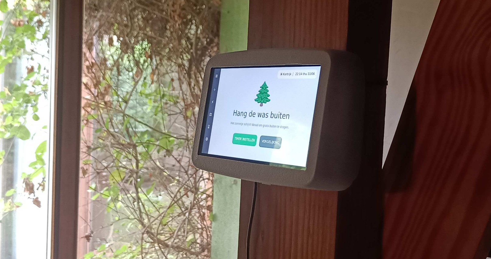

# De Drooghulp
De drooghulp is een slim apparaatje dat helpt de beste manier te kiezen om de was te drogen.

🛠️ Built by ``Djurre Roose`` & ``Jutte De Baets``   
🔥 Supervised by ``prof. dr. Bas Baccarne``, ``Yannick Christiaens`` & ``Wouter Devriese``    
🌱 Grown at ``Ghent University`` 🏛️ ``Industrial Design Engineering`` ([project overview](https://github.com/basbaccarne/human-centered-design))       

*12/06/2026 van de laatste update*   

## Samenvatting
"Met het wisselvallige Belgische weer is het lastig te voorspellen of je de was buiten kunt hangen. Ook binnen drogen is niet altijd ideaal. De droogkast is dan vaak de makkelijkste, maar helaas ook de minst ecologische keuze.

Uit onze interviews over drooggewoontes blijkt dat de angst voor vocht en geuroverlast de belangrijkste reden is om niet binnen te drogen. Ook brachten we in kaart wanneer mensen hun wasmachine precies aanzetten.

Onze 'drooghulp' adviseert wat de beste droogoptie is, met als doel de droogkast zo min mogelijk te gebruiken. Dit is beter voor de planeet én voor je portemonnee. Het systeem analyseert weersvoorspellingen (voor buitendrogen) en voert zelf metingen uit om te zien of binnen drogen mogelijk is. Is de droogkast toch de enige optie? Dan checkt de hulp of het slim is om even te wachten tot het daltarief ingaat."

  

  
## Introductie
De opdracht was helder: ontwerp een fysiek product dat een probleem oplost en leidt tot een duurzamere uitkomst.

Wij richten ons op het drogen van de was. In de praktijk gebeurt dit op drie manieren: buiten aan de lijn, binnen op een rekje of in de droogkast. Hoewel de droogkast door het hoge energieverbruik ecologisch de minst gewenste optie is, kiezen velen hier toch voor vanwege het gemak. Dit is wat wij willen veranderen met de drooghulp. 

De drooghulp die wij ontwikkelen moet de duurzame opties weer vanzelfsprekend maken. Ons hoofddoel is het energieverbruik te verminderen door gedragsverandering te stimuleren. Een belangrijke randvoorwaarde hierbij is dat het apparaat zich beperkt tot slim advies en meldingen; het fysieke ophangen van de was blijft de taak van de gebruiker." Om hierin te slagen is het cruciaal om het was ritueel van de gebruiken te begrijpen om hierop te kunnen inspelen. Het product moet snel kort en krachtig kunnen communiceren met de gebruiker zodat het nauwelijks merkbaar is dat het gebruikt is geweest. Tegelijkertijd moet het meer info kunnen bieden als dit gewenst is zodat het advies geloofwaardig blijft en de gebruiker een duidelijk beeld kan krijgen van de opties. 

## Inhoudstafel

1. [Methodologie](./docs/methodologie.md)
2. [Discovery](./docs/discovery.md)
3. [Defintion](./docs/definition.md)
4. [Develop 1](./docs/develop1.md)
5. [Develop 2](./docs/develop2.md)
6. [Develop 3](./docs/develop3.md)
7. [Design Requirements](./docs/design_requirements.md)
8. [Bill of materials (BOM) + Bouwinstructies](./docs/Bill%20of%20Materials%20(BOM)%20+%20Bouwinstructies.md)
9. [Conclusion](./docs/conclusion.md)

## Video

  

<em>Klik op de afbeelding om de video te openen.</em>

## Ontwerpproces (in het kort)
### Discovery
Tijdens de Discovery-fase werd de initiële probleemruimte grondig onderzocht om te achterhalen hoe consumenten gestimuleerd kunnen worden om thuis duurzamer te leven. De focus verschoof al snel naar de wasruimte, aangezien kwantitatieve data aantoonden dat witgoedmachines en met name droogkasten tot de grootste energieverbruikers binnen een gemiddeld huishouden behoren. Uit kwalitatief gebruikersonderzoek bleek dat de keuze om de droogkast te gebruiken vaak voortkomt uit een diepwortelende onzekerheid over de wisselvalligheid van het weer. Om deze drempel weg te nemen en visuele nudging toe te passen, ontstond het eerste concept: een interactieve assistent die consumenten voorziet van een proactief en contextueel droogadvies op basis van live weersomstandigheden en actuele energieprijzen met een simpele kleur gevende ledlamp.
 
### Definition
In de Definition-fase werd dit concept vertaald naar tastbare interacties door middel van twee opeenvolgende golven (waves) van lofi-prototypes. Tijdens de eerste testwave werden minimalistische kartonnen modellen ingezet waarbij uitsluitend een heel summier advies werd getoond; de feedback wees echter uit dat gebruikers zonder extra contextuele data te weinig vertrouwen hadden in het systeem. Een tweede wave van prototypes, waarin aanzienlijk meer randinformatie werd toegevoegd, loste dit wantrouwen op maar introduceerde een nieuw risico op visuele ruis. De Definition-fase werd vervolgens afgerond door de belangrijkste learnings uit deze twee golven te synthetiseren tot één geconsolideerd prototype, waarin alle kritieke gebruikersbehoeften werden samengebracht op één overzichtelijk basisscherm.
 
### Develop 1
Bij de start van de Develop 1-fase werd dit geconsolideerde prototype kritisch geanalyseerd, waarbij bleek dat de focus te veel was verschoven naar het simpelweg inwilligen van de functionele datavraag van de gebruiker. De interface leed onder cognitieve overbelasting, waardoor de kerndoelstelling het snel bieden van een glashelder advies in het gedrang kwam. Om dit op te lossen, werd de complete interface-indeling herzien en werd de informatie gestructureerd via een doordachte data-architectuur. Dit resulteerde in een nieuw, gelaagd prototype waarin extra features werden geïntroduceerd (zoals een handmatige timer, een sneltoets voor de snelste droogroute en een selectiemenu voor drie generieke wassoorten) om het advies te personaliseren en de bruikbaarheid te verhogen.
 
### Develop 2
Tijdens de Develop 2-fase werd dit gelaagde model onderworpen aan intensieve bruikbaarheidstesten om de interacties over meerdere iteraties te optimaliseren. Uit de eerste tests bleek namelijk een kritieke ontwerpfout: de informatie en de nieuwe sub-functies waren té diep verstopt in de architectuur, waardoor proefpersonen de weg kwijtraakten en de interface niet volledig begrepen. Er werd direct een iteratieslag gemaakt waarbij de volledige user flow werd gestroomlijnd; alle secundaire functies en datarijke overzichten werden resoluut verplaatst naar diepere sub-schermen. Het hoofdscherm werd hierdoor bevrijd van ruis en puur gereserveerd voor de primaire interactie: het in één oogopslag tonen van de meest optimale en duurzame droogoptie, waarna de gebruiker via een logische doorklikroute direct een gepersonaliseerde timer kon activeren.
   
### Develop 3
In de Develop 3-fase verschoof de focus van de digitale interface naar de fysieke en emotionele productbeleving door middel van een uitgebreide CMF-verkenning (Color, Material, Finish). Om een brede ontwerprichting te garanderen en confirmation bias te voorkomen, werden in de exploratieve fase meer dan 30 esthetische varianten gegenereerd. Deze werden gecureerd tot drie uitgesproken archetypen die elk inspeelden op een andere gebruikersbehoefte: de herkenbaarheid van The Clean Standard, de huiselijke rust van The Natural Home, en de deskundige uitstraling van The Tech Authority. Kwalitatieve gebruikerstesten met fysieke materiaalstalen gaven uiteindelijk de doorslag. Waar proefpersonen de koude autoriteit van metaal te klinisch vonden en de combinatie van hout en vilt te veel vonden afleiden van de technologische functie, was er een unanieme voorkeur voor een hoogwaardige, matwitte kunststof behuizing. Deze definitieve materiaal- en kleurkeuze creëert een directe viscerale match met het bestaande witgoed in de wasruimte. Hierdoor eist het product niet onnodig de aandacht op, maar integreert het als een betrouwbare en herkenbare assistent in de dagelijkse routine van de gebruiker.
  
### Kritische reflectie & Toekomst
Hoewel de drooghulp een bewezen meerwaarde toont, kent het project enkele methodische, technische en gedragspsychologische beperkingen die in toekomstig onderzoek geadresseerd moeten worden. Zo is de proactieve notificatiecyclus via een Wizard of Oz-methode succesvol gevalideerd, maar is een volwaardige smartphone-applicatie wegens scope-beperkingen niet volledig gecodeerd; een langdurige in-the-wild test in een huishoudelijke context is dan ook vereist om te meten of de visuele nudges op de lange termijn effectief blijven of dat er gewenning optreedt. Een dergelijke test helpt tevens de 'gemaksbarrière' te onderzoeken, aangezien de nudging bij gebruikers die puur uit gemakzucht de droogkast verkiezen boven het fysiek ophangen van de was, op termijn als intrusief kan worden ervaren. Daarnaast leunt het concept momenteel op de technische aanname van een stabiele internetverbinding voor live weersdata—wat een offline back-up functionaliteit noodzakelijk maakt voor kelders—en kampt het met een fysieke omgevingsafhankelijkheid, omdat de lokale sensoren een vertekend beeld geven als het apparaat in de wasruimte hangt maar de was elders droogt. Tenslotte kent de huidige interface een beperking op het gebied van Universal Design omdat de statuscommunicatie puur steunt op een chromatisch feedbacksysteem (groen, oranje, rood), wat de toegankelijkheid voor kleurenblinde gebruikers hindert en in de toekomst opgevangen moet worden met redundante, haptische of vormveranderende signalen. Deze optimalisaties kunnen direct worden gekoppeld aan een grotere, meer diverse teststeekproef en de integratie van een proactieve weekvoorspelling en een maandelijks besparingsdashboard met social/gamification elementen om de gebruikersretentie duurzaam te verhogen.

### Conclusie
De uiteindelijke drooghulp bewijst zich als de best mogelijke oplossing voor het gestelde duurzaamheidsprobleem. Waar de assistent aanvankelijk werd ingestoken als een pure, cijfermatige energie- en kostenbespaarder, heeft het empirische ontwerpproces aangetoond dat de werkelijke sleutel tot ecologische impact ligt in het extreem vergemakkelijken en ontzorgen van de gebruikservaring. Door de drempels van weersonzekerheid weg te nemen via een feilloze user flow, een gelaagde informatiearchitectuur en een contextueel passende behuizing, stimuleert dit product duurzaam gedrag op een natuurlijke manier; het maakt van de ecologische keuze simpelweg de meest logische en gemakkelijke keuze binnen de dagelijkse routine van de consument.

## Noot inzake het gebruik van AI
Ai is gebruikt om Taalfouten uit onze tekst te halen en de tekst vloeiend leesbaar te maken.

## Bijlagen
### Discovery
* Benchmarks (N=10)
  * [Protocol](./reports%20and%20protocols/Protocol%20Benchmark%20Duurzame%20Was_Droogtechnologieen.docx.pdf)
  * [Rapport](./reports%20and%20protocols/Benchmark%20analyse.docx.pdf)
* Interviews (N=3)
  * [Protocol](./reports%20and%20protocols/Interview%20-%20protocol%20-%20Sustainability%20at%20home.docx.pdf)
  * [Rapport](./reports%20and%20protocols/Interview%20analyse.docx.pdf)
    
### Definition
* User testing wave 1 (N=5)
  * [Protocol](./reports%20and%20protocols/Officieel%20Protocol%20wave%201.pdf)
  * [Rapport](./reports%20and%20protocols/Officieel%20rapport%20test%20wave%201.pdf)
* User testing wave 2 (N=5)
  * [Protocol](./reports%20and%20protocols/Officieel%20Protocol%20Wave%202%20.pdf)
  * [Rapport](./reports%20and%20protocols/Officieel%20Rapport%20Test%20Wave%202.pdf)

### Develop 1
* User tests (N=4):
  * [Protocol](./reports%20and%20protocols/Protocol%20test%203.pdf)
  * [Analyse](./reports%20and%20protocols/Analyse%20develop%201.pdf)
  

### Develop 2
* User tests (N=4):
  * [Protocol](./reports%20and%20protocols/Interviewprotocol%20DEV2.pdf)
  * [Analyse](./reports%20and%20protocols/Document%202%20Analyse%20testen%20%26%20design%20requirments%20.pdf)

### Develop 3
* AI-analyse(N=8):
  * [Onderzoek](./reports%20and%20protocols/Develop%203%20-%20CMF%20onderzoek.pdf)
* User tests (N=4):
  * [Protocol](./reports%20and%20protocols/Develop%203%20-%20CMF%20protocol.pdf)
  * [Analyse](./reports%20and%20protocols/Develop%203%20-%20CMF%20analyse.pdf)

## Licentie

This repository contains both software and design materials created as part of an industrial design energineering project at Ghent University.

- **Software and code:** [MIT License](./LICENSE-MIT)  
- **Design, documentation, CAD, and media:** [CC BY 4.0 License](./LICENSE)
  
You are free to reuse and build upon this work, both commercially and non-commercially, as long as proper attribution is given to the original authors.

## Bronnen

Milieu Centraal. (z.d.). Wasdrogers. Geraadpleegd op 29 oktober 2025, van https://www.milieucentraal.nl/energie-besparen/apparaten-in-huis/wasdroger/

Nibud. (2025). Kosten van energie en water. Geraadpleegd op 29 oktober 2025, van https://www.nibud.nl/onderwerpen/uitgaven/kosten-energie-water/

Bosch & Siemens. (z.d.). Home Connect: Slimme huishoudtoestellen. Geraadpleegd op 25 oktober 2025, van https://www.home-connect.com/nl/nl/

Ecoegg. (z.d.). Ecoegg: Sustainable washing made easy. Geraadpleegd op 25 oktober 2025, van https://www.eco-egg.eu/

Ecozone. (z.d.). Tumble Dryercubes: Reduce drying time & save energy. Geraadpleegd op 25 oktober 2025, van https://ecozone.com/products/ecozone-dryer-cubes-2/

Electrolux. (z.d.). Connectivity: My Electrolux Care app & Care Advisor. Geraadpleegd op 25 oktober 2025, van https://www.electrolux.co.uk/about-us/connectivity/

Guppyfriend. (z.d.). GUPPYFRIEND Washing Bag: Stop Microplastics. Geraadpleegd op 25 oktober 2025, van https://en.guppyfriend.com/

HomeWizard. (z.d.). Energy Socket: Sluipverbruik meten en schakelen. Geraadpleegd op 25 oktober 2025, van https://www.homewizard.com/nl-be/energy-socket/

JouleBug. (z.d.). JouleBug: Employee Engagement for Sustainability. Geraadpleegd op 25 oktober 2025, van https://www.joulebug.com/

Miele. (z.d.). Miele@Home: Slimme toestellen, probleemloos wonen. Geraadpleegd op 25 oktober 2025, van https://www.miele.be/nl/c/mielehome-2386.htm

Samsung. (z.d.). SmartThings Energy: Energiebesparing voor je huis. Geraadpleegd op 25 oktober 2025, van https://www.samsung.com/be/home-appliances/smartthings/energy/

Sense. (z.d.). Sense Energy Monitor: Real-time home energy monitoring. Geraadpleegd op 25 oktober 2025, van https://sense.com/

Agostini, C. (2025). Drying Buddy [Mobiele app]. Apple App Store. Geraadpleegd op 1 maart 2026, van https://apps.apple.com/app/drying-buddy/id6746894131

Ortega Campos, I. (n.d.). Laundry Timer – Weather-based clothes drying time calculator. Geraadpleegd op 1 maart 2026, van https://www.laundrytimer.com

Nikhil. (n.d.). DryCast – Smart laundry weather forecast. Geraadpleegd op 1 maart 2026, van https://drycast.app

Niko. (n.d.). Niko Home Control II – Digital Black. Geraadpleegd op 27 april 2026, van https://www.niko.eu/nl-be/producten/niko-home-control/schermen-en-bedieningen/digital-black   

Google Nest. (n.d.). Nest Learning Thermostat (3rd & 4th Generation). Geraadpleegd op 27 april 2026, van https://store.google.com/category/nest_thermostats   

ecobee. (n.d.). Smart Thermostat Premium. Geraadpleegd op 27 april 2026, van https://www.ecobee.com/smart-thermostats   

Basalte. (n.d.). Ellie – Luxury smart home display. Geraadpleegd op 27 april 2026, van https://www.basalte.be/nl/producten/ellie   

Gira. (n.d.). Gira G1 – De compacte centrale voor de gebouwentechniek. Geraadpleegd op 27 april 2026, van https://partner.gira.com/nl_NL/producten/gira-g1   

Bang & Olufsen. (n.d.). Beoremote Halo – Luxury remote control. Geraadpleegd op 27 april 2026, van https://www.bang-olufsen.com/nl/be/accessories/beoremote-halo   

JUNG. (n.d.). Smart Panel 8 – Touchdisplay voor gebouwbesturing. Geraadpleegd op 27 april 2026, van https://www.jung-group.com/nl-NL/Producten/Systemen/Smart-Panel-8   

Control4. (n.d.). T4 Series Smart Home Touchscreens. Geraadpleegd op 27 april 2026, van https://www.control4.com/solutions/interfaces/touch-screens