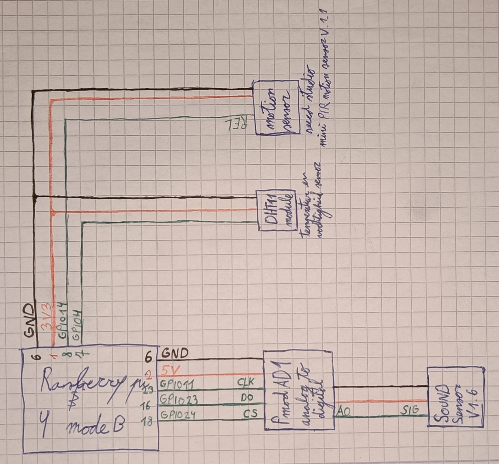
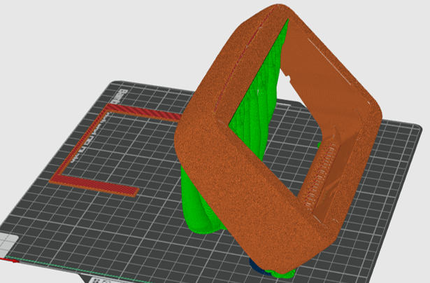
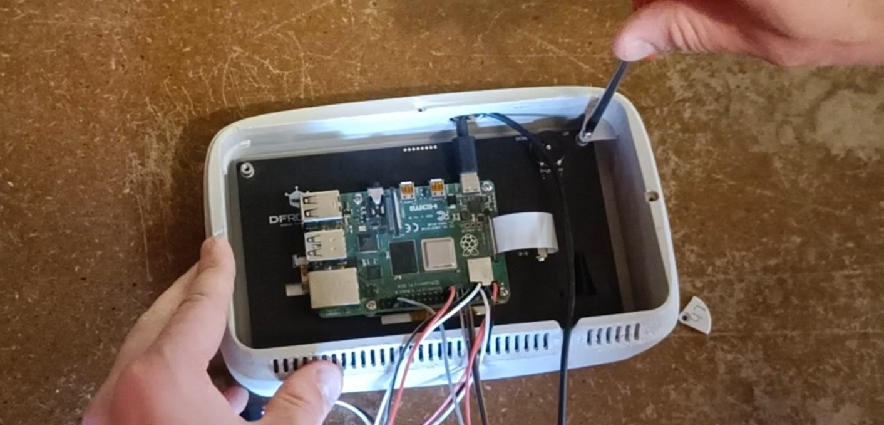

# Bill of Materials (BOM) + Bouwinstructies + code

Dit document bevat de volledige lijst met componenten, specificaties en de geschatte kosten voor de Raspberry Pi opstelling. Ook vindt je hier een stap voor stap gids om het product zelf na te bouwen.

## BOM Overzichtstabel

| Component | Omschrijving & Specificaties | Leverancier / Link | Prijs |
| :--- | :--- | :--- | :--- |
| **Raspberry Pi Kit** | Raspberry Pi 4 Model B | [SOS Solutions](https://www.sossolutions.nl/raspberry-pi-5-1gb-starter-kit-compleet) | € 70,00 - € 80,00 |
| **Voeding** | Inbegrepen in de Pi-kit (5V DC minimaal 2A) | - | - |
| **Touchscreen** | DFRobot LCD Touchscreen with 7 in TFT Colour Display | [RS-online](https://benl.rs-online.com/web/p/raspberry-pi-screens/2473220) | € 49.51 |
| **DSI-lintkabel** | Inbegrepen bij het scherm | - | - |
| **4x Metaalschroeven** | Inbegrepen bij het scherm | - | - |
| **Vochtigheid & temperatuur sensor**| DHT11 | [Ben's electronics](https://www.benselectronics.nl/dht11-board-) | € 2,99 |
| **Beweging sensor** | Grove ‐ mini PIR motion sensor | [RS-online](https://benl.rs-online.com/web/p/sensor-development-tools/1845083) | € 5,35 |
| **Sound sensor** | Seeed Studio Sound Sensor Grove System | [RS-online](https://benl.rs-online.com/web/p/sensor-development-tools/1743255) | € 3,44 |
| **Analog to digital converter** | ADC Pmod AD1 | [RS-online](https://benl.rs-online.com/web/p/signal-conversion-development-tools/1346443) | € 28,66 |
| **Jumperdraden** | Set Male/Female & Female/Female | [Gotron](https://www.gotron.be/jumper-kabel-mannelijk-vrouwelijk-40-x-18cm.html) | € 4,50 |
| **Behuizing** | 170g (3d geprint) | [3mf-bestanden](./cad/README.md) | ~ € 3,50 |
| **Vijsjes** | 200 stuks plaatschroef verzinkt verzonken kop 3,5 x 9,5 mm | [Ecotools](https://www.ecotools.be/200stuks-verzinkte-plaatschroef-verzonken-3-5x9-5-mm?gad_source=1&gad_campaignid=23725382052&gclid=Cj0KCQjw_7PRBhDcARIsAMjV7jmjKEYO-8XQVws-kxuUlLlNSls5P48FJXvvkoZzqc7jK9M2gftM3_IaAmmAEALw_wcB) | € 4,25 |
| **TOTAAL** | | | **€ 172,2- € 182,2** |

Deze kost is om een werkend prototype te maken en zou dus niet de verkoopprijs zijn.

## Bouwinstructies
### De elektronica
Start met de componenten te schakelen zoals hieronder is weergegeven.

  

Schroef de rasberry pi op het scherm en verbindt de lintkabel.
Nu is het moment om het systeem te testen en te debuggen. Via deze [link](https://github.com/JutteDeBaets/drooghulp-code.git) vind je de github die de code draait voor het systeem. (Vergeet niet de library’s te installeren.)

### 3d printen
3d print de bestanden (deze vindt je [hier](./cad/README.md)) moet volgende instellingen: tree support, een fuzzy skin met punt afstand 0.4 en dikte 0.2 en de behuizing gekanteld zoals op de afbeelding zodat printlijnen minder zichtbaar ogen.

  

Alle andere onderdelen kunnen geprint worden met standaar instellingen. Het gebruikte materiaal is PLA met kleur en afwerking mat wit.

### Het assembleren
Plaats het scherm in de behuizing. En gebruik de onderdelen LO (link onder) LB (links boven) RB (rechts boven) en RO (rechts onder) om het scherm vast te schroeven in de behuizing.

  

En plaats alle sensoren in de behuizing. Voor je het deksel op de behuizing schroeft moet eerst het voetstuk aan het deksel bevestigd worden. Dit doe je door langs de zijkant een stuk ijzerdraad te duwen die door het deksel en voetstuk gaat. Knip hierna de te veel uitstekende ijzerdraad eraf. Hierna kun je het deksel op de behuizing vijzen.

En voilà de drooghulp is klaar om ergens opgehangen of gezet te worden.

## Extra info voor gebruik
De sensoren en code voor dit prototype is voldoende om gebruikerstesten mee te doen maar niet af genoeg om nuttig advies te geven. Hiervoor is de code niet uitgebreid genoeg en de sensoren zijn niet fijn genoeg. Wens je dit toch te gebruiken als adviseur zal je dus betere sensoren moeten aanschaffen en de code verder moeten verfijnen.
