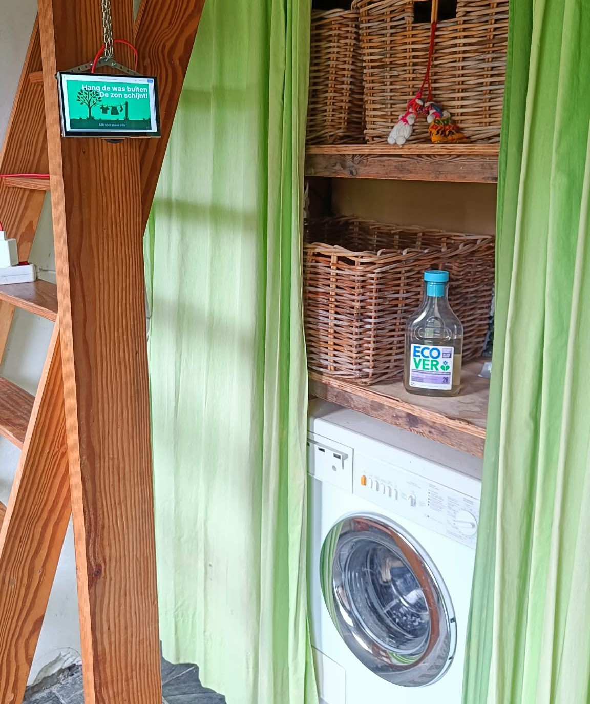

## Develop 2

In deze fase verschuiven we de focus van de functionele architectuur ("hoe het werkt") naar de menselijke ervaring ("hoe het voelt"). Het doel is om een frictieloze usability te garanderen door middel van een onderbouwd ergonomisch ontwerp en een interactief, testbaar prototype. 

### 1. Antropometrie (The Body)

Om een inclusief ontwerp te garanderen voor zowel kleine als grote gebruikers, hanteren we de strategie "Design for the Range" (P5 vrouw tot P95 man).
Touchpoints:
-	Interactieve knoppen: Afmetingen zijn gebaseerd op de P95 breedte van de mannelijke duim om het "fat finger"-syndroom te voorkomen.
-	Behuizing & Montage: De vorm van de achterplaat suggereert intuïtief de wandmontage (Affordance).
-	Display: Geplaatst op een hoogte die rekening houdt met de ooghoogte van de P5 vrouw en P95 man.
Methode:
De fysieke plaatsing wordt geëvalueerd via een antropometrische analyse:
-	Centrale hoogte: Het scherm wordt op circa 150 cm geplaatst om bukken of extreem omhoog kijken te voorkomen.
-	Zichthoek: Het scherm wordt 10° naar boven gekanteld om een optimale kijkhoek van 15° tot 30° onder de horizontale ooglijn te faciliteren.
-	Reikwijdte: Alle interactieve elementen bevinden zich binnen de functional reach van een P5-vrouw.

### 2. Cognitieve & Sensoriële Ergonomie (The Senses)

We passen theoretische kaders toe om de mentale inspanning (cognitive load) te minimaliseren.
-	7 Stages of Action (Don Norman): We overbruggen de kloof van executie door sterke Signifiers (knoppen zien er klikbaar uit door schaduwen) en de kloof van evaluatie door directe Feedback binnen 100ms na interactie.
-	GESTALT-wetten: Toepassing van de wet van nabijheid (groeperen van sensordata) en de wet van gelijkenis (uniforme kleuren voor actieknoppen) voor snelle visuele scanning.
-	Informatieverwerking: Gebruik van Chunking (data verdelen in 'huidig', 'verwachting' en 'conclusie') en Recognition over Recall (het systeem rekent, de gebruiker kiest).

### 3. Onderzoek vorige interface

Om een beter beeld te krijgen van de werking van de vorige interface hebben we visueel de werking in kaart gebracht. Dit gaf ons het inzicht dat veel info te ver verstopt zat. 

  

### 4. Prototyping

Om meerdere soorten interface indelingen te testen maakten we 2 nieuwe interactieve interfaces en gaven we de interface van develop 1 een upgrade. Deze interfaces zijn uit te testen met onderstaande links.

  

   https://www.figma.com/make/eZPW0BnClApe49g8YHyUMO/Drooghulp-interface-ontwerp?p=f&t=NMr2d6Sv9QcEJlpp-0&fullscreen=1
 

  

   https://www.figma.com/make/7309jMH7ZI871FKBrxq22L/Drying-Assistant-Mobile-App?p=f&t=sFJvCSBbV3VuNE8k-0&fullscreen=1
 

  

   https://www.figma.com/make/KFGs5Qj9Rqt3SuG3kG3caE/Mobiel-startscherm-slimme-was-assistent--Copy-?p=f&t=eOJxrHsdTcD9R4hi-0&fullscreen=1
 

### 5. Testen

De touchscreen wordt in de wasruimte geplaatst op een hoogte van ongeveer 150cm en wordt 10° gekanteld naar boven. De antropometrische studie leerde ons dat dit de optimale locatie is voor een scherm dat rechtstaand bediend moest worden. Of dat dit ook zo is wordt hier dus getest. Aangezien de opstelling met een ketting is vastgemaakt was de hoogte verstelbaar. Hierna werden de 3 figma make intefaces op het touchscreen gezet.

  

Rapports(N=4):
  * [Protocol](../reports%20and%20protocols/Interviewprotocol%20DEV2.pdf)
  * [Analyse](../reports%20and%20protocols/Document%202%20Analyse%20testen%20%26%20design%20requirments%20.pdf)

  

### Kritische Reflectie

Naast het softwarematige onderzoek en de functionele analyses, hebben we een technische verkenning uitgevoerd naar de hardware voor het prototype van De Drooghulp. Hierbij zijn verschillende microcontrollers en computerplatforms onderzocht, waaronder de mogelijkheden van Arduino. Uiteindelijk is de keuze gevallen op een Raspberry Pi. De belangrijkste reden hiervoor is de behoefte aan een krachtig platform dat simultaan een groot aantal verschillende sensoren kan aansturen die essentieel zijn voor de nauwkeurigheid van het droogadvies. Voor het prototype willen we de volgende data integreren: 
- Temperatuur en Luchtvochtigheid: Voor het berekenen van de verdampingstijd. 
- Beweging: Om te detecteren of de was buiten hangt of binnengehaald wordt. 
- Geluid: Voor mogelijke feedback of statusmeldingen van wasmachines. 
- Display: De Raspberry Pi maakt het mogelijk om direct een scherm aan te sluiten, wat cruciaal is voor de UX.