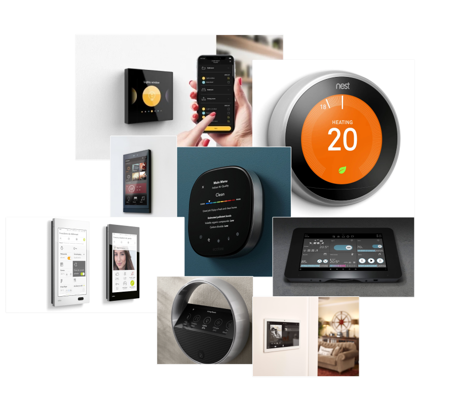
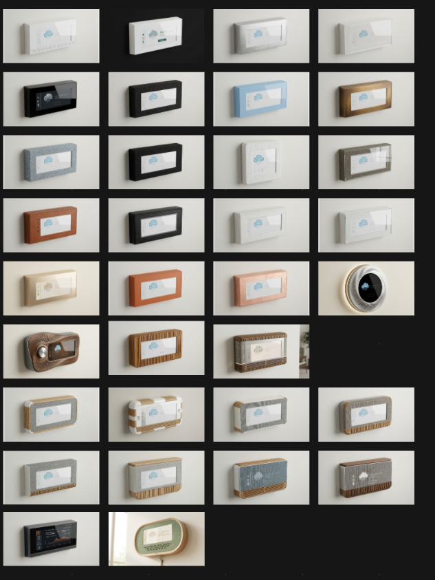
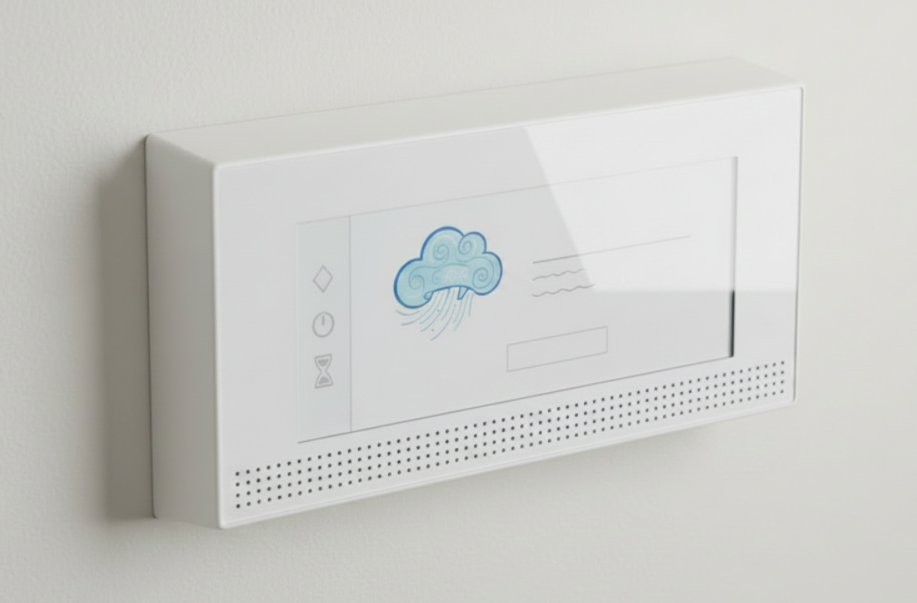
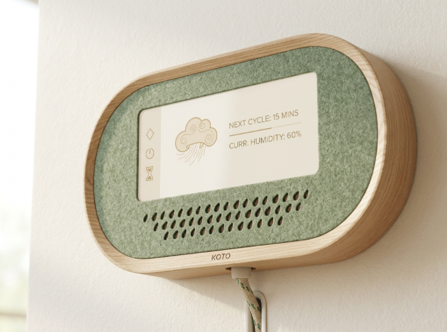
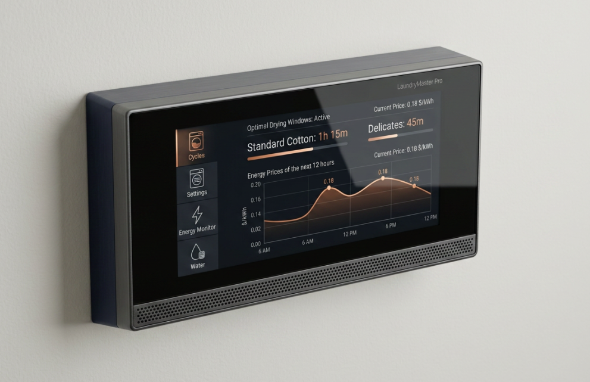
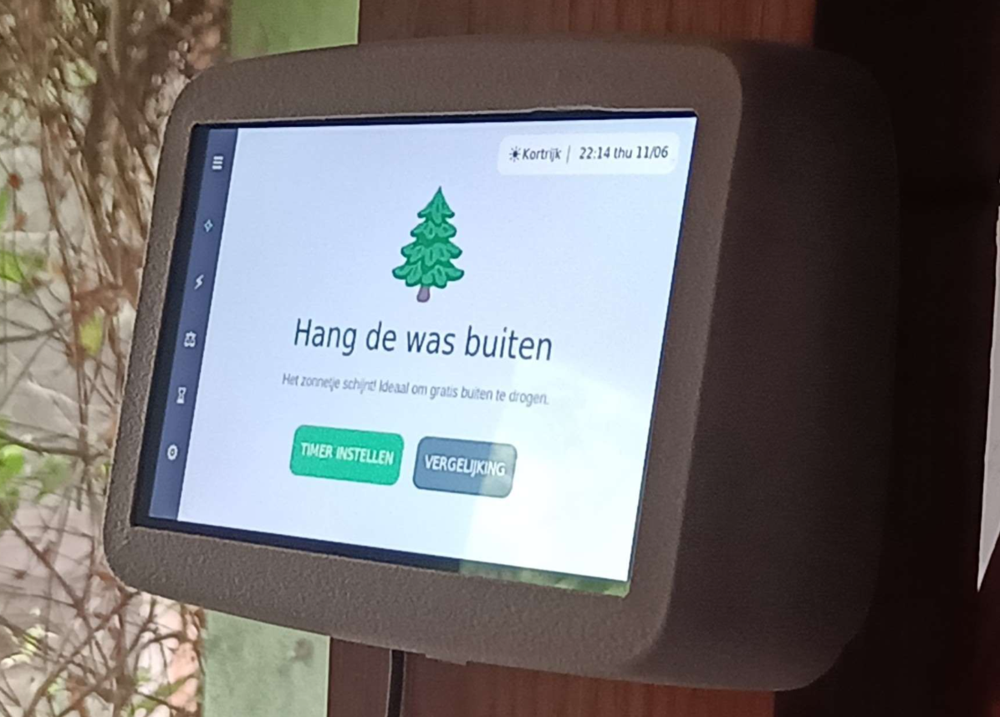

## Develop 3
Deze fase focuste op de uiterlijke en materiële afwerking van het product, om zo tot een hoogwaardige en presentatieklare productbepaling te komen.

### 1. Ai-analyse huidige producten

Via een AI-gestuurde analyse hebben we de designtalen en trends van de huidige markt voor binnenhuisschermen onderzocht. Hiervoor is een deconstructie uitgevoerd van acht toonaangevende wandschermen en slimme thermostaten (waaronder de Nest Learning Thermostat, Gira G1 en Bang & Olufsen Beoremote Halo). Deze benchmarking onthulde een duidelijke tweedeling:

'Invisible Tech' (o.a. Jung en Gira): Producten die via vlakke, sobere glasoppervlakken volledig opgaan in de architectuur.

'Jewelry Tech' (o.a. Nest, Basalte en B&O): Producten die fungeren als een sieraad in het interieur, waarbij metaal, textuur en iconische vormen centraal staan.

Het identificeren van deze tweedeling vormde het strategische vertrekpunt voor onze conceptuele divergentie. Het bracht het esthetische spectrum in kaart waarbinnen de slimme wasassistent zijn eigen identiteit moet gaan vinden."

  

### 2. CMF-matrix

Na het genereren van meer dan dertig varianten, zijn er drie distinctieve archetypen geselecteerd voor gebruikerstesten. Deze selectie is opgebouwd rond Donald Normans drielagige model uit 'Emotional Design': het viscerale, gedragsmatige en reflectieve niveau.  

  

Variant 1 — 'The Clean Standard': Vervaardigd uit mat wit ABS-polymeer met een semi-gloss behuizing en glad glas. Dit archetype is ontworpen om een viscerale match te vormen met bestaand witgoed, waardoor de psychologische adoptiedrempel verlaagt.

  

Variant 2 — 'The Natural Home': Combineert licht essenhout met saliegroen vilt en een ultra-matte finish. Het positioneert de assistent als een rustgevend meubelstuk dat de technologische aanwezigheid verzacht.  

  

Variant 3 — 'The Tech Authority': Gemaakt van geanodiseerd aluminium (Deep Navy/Charcoal) met anti-fingerprint coating. Het straalt een 'investor-ready' autoriteit en bekwaamheid uit, met als doel de gebruiker te motiveren het technische advies op te volgen.

  

### 3. Test protocol

Om de ontwerpen robuust te toetsen en confirmation bias te vermijden, werd een testprotocol opgesteld met vier respondenten. De test bestond uit een gecontroleerde sequentie:  
Stap A (Viscerale eerste indruk): Respondenten kregen de renders te zien zonder de materialen aan te raken.  
Stap B (Gedragsmatige tactiele interactie): Men testte fysieke stalen: glad wit kunststof (Sample A), multiplex/vilt (Sample B), sheet metal (Sample C) en een experimentele 3D PLA-print met ruwe 'fuzzy skin' (Sample D).  
Stap C (Reflectieve scenario-check): Contextuele vragen over vertrouwen en gezag rondom energiebesparing

### 4. Analyse gebruikersfeedback

De kwalitatieve testfase leverde scherpe en convergente inzichten op, gestructureerd in vier thema's:  

Dominantie van de Witte Standaard: Alle respondenten kozen Variant 1 voor installatie in hun wasruimte. Gebruikers refereerden naar de match met hun huidige (witte) witgoed en de sterke associatie met hygiëne en netheid.  

De 'Slimme Paradox': Hoewel Variant 3 (aluminium/zwart) unaniem werd geprezen als het visueel 'slimste' en meest autoritaire apparaat, werd het afgewezen voor daadwerkelijke installatie. Gebruikers vonden het te zwaar ('heavy') en oordeelden dat het botst met de fysieke inrichting van een doorsnee wasruimte.  Weerstand tegen 'Te Groen': De houten Variant 2 werd omschreven als 'te ecologisch' en wekte een imago-clash op met de functionele en hygiënische verwachtingen van een wasruimte. Tactiel voelde het hout bovendien 'zwak' en 'te ruw' aan in vergelijking met metaal of kunststof.  
Afwijzing van de Fuzzy skin: Sample D (de fuzzy skin PLA-print) werd sterk afgewezen als 'vreemd' en 'niet goed'. De ruwe structuur werd perceptief onmiddellijk gekoppeld aan een goedkoop eindresultaat.

### 5. Definitive design beslissingen.

De data convergeerde ondubbelzinnig naar de keuze voor 'The Clean Standard' (Variant 1).  

Productie en Materiaal:
Er is gekozen voor een hoogwaardig matwit polymeer (ABS), direct herleidbaar uit de voorkeur voor Sample A. Afhankelijk van de schaal wordt het product vervaardigd via industriële 3D-printtechnologieën (prototyping/kleine reeksen) of spuitgietmatrijzen (massaproductie).  

Afwerking (Finish):
Gebaseerd op de afwijzing van ruwe texturen, krijgt het eindproduct een glad oppervlak met een uiterst subtiele micro-korrel. Dit wordt bereikt via micro-fuzzy skin bij 3D-printing, of chemische etsing/vonkerosie bij spuitgieten. Dit zorgt ervoor dat vingerafdrukken visueel verdwijnen, terwijl het materiaal 'koel en klinisch' blijft aanvoelen.  

Conclusie:
Het finale ontwerp overbrugt twee marktposities. Door de vertrouwde, sobere witte kleur ('Invisible Tech') te combineren met een vloeiende, verfijnde vormtaal, straalt de assistent rust én deskundigheid uit. Het apparaat creëert een wrijvingsloze omgeving waarin de gebruiker vol vertrouwen het beste advies kan opvolgen. 

  

