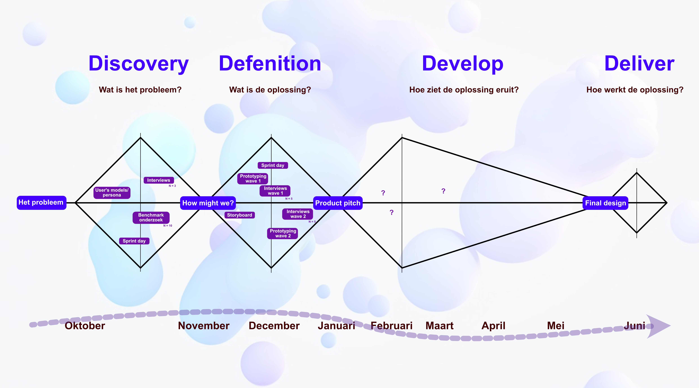

Voor dit project pasten we de Double Diamond-methodologie toe. In het eerste semester lag de focus op het doorgronden van het probleem en het definiëren van de oplossing. 

  

1. Discovery: Wat is het probleem? (Oktober – November) In deze divergerende fase stond het verzamelen van inzichten centraal. 

Activiteiten: We startten met het opstellen van persona’s en user models. Daarnaast organiseerden we een eerste Sprint Day om de gebruikerscontext in kaart te brengen. 

Onderzoek: We voerden een benchmarkonderzoek uit (N=10) naar bestaande oplossingen en valideerden de gebruikersbehoeften via interviews (N=5). 

2. Definition: Wat is de oplossing? (November – Januari) Vanuit de kernvraag 'How might we?' werkten we in deze fase convergerend toe naar een gevalideerd concept. 

Concepting: Het idee werd gevisualiseerd tijdens een Sprint Day en verder uitgewerkt in een storyboard. 

Iteratief Testen: Het ontwerp is in twee cycli (waves) verfijnd: 

Wave 1: Eerste prototype en validatie via interviews (N=5). 

Wave 2: Doorontwikkeling van het prototype en tweede validatieronde (N=5). 

Afsluiting: We ronden het semester in januari af met een productpitch. Dit vormt het startpunt voor de latere Develop- en Deliver-fasen. 

